# No Coding Easy Localization

No Coding Easy Localization is a package that makes it easy to support other languages without coding.

It provides the ability to manage language data and switch between languages.

No Coding Easy Localization uses Scriptable Objects to manage data in each language, making it possible to manage data with high versatility.

GUI Text and 3D Text and GUI Image are supported.

## Master Data

The following scritable objects are used to manage the language data.

* Easy Localization/MasterData/LocalizeMaster.asset

Use this to change or increase/decrease the languages in the langs list.

 
 
 
 

## Master Data Window

Select `Tools > NoCodingEasyLocalization` from the menu bar to open a window where you can edit the master data.

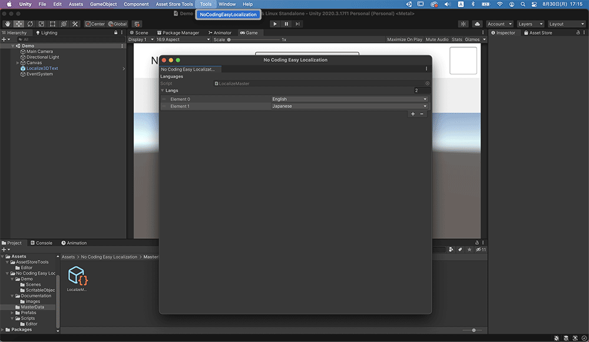

 
 
 
 

## String Data

String data to be associated with GUI Text and 3D Text are also managed by scritable objects.

Right-click in the project window and select the following item.

Create > Tools > NoCodingEasyLocalization > LocalizeData

This will create a scritable object to manage the string data for each language.

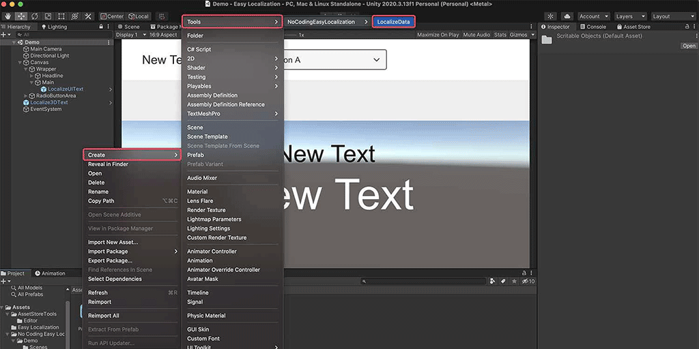

When you select a scritable object, the inspector will show you a list of languages managed by MasterData, and you can enter a string for each language.

Enter the text for each language. The Default Text at the bottom is the text that will be displayed if none of the user's languages are selected.

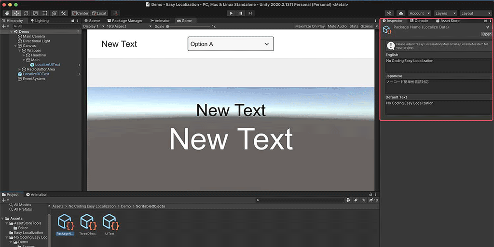

## Prefabs I'm preparing

The following four prefabs are available. You can use them to easily introduce other language features.

### Localize3DText

This is a 3D text prefab with the ability to support other languages.

You can use it by changing the value of the Localize Scritable Object in the red frame of the image.

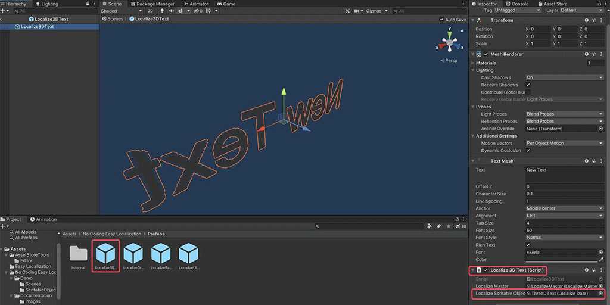

### LocalizeUIText

This is a UI text prefab with the ability to support other languages.

You can use it by changing the value of the Localize Scritable Object in the red frame of the image.

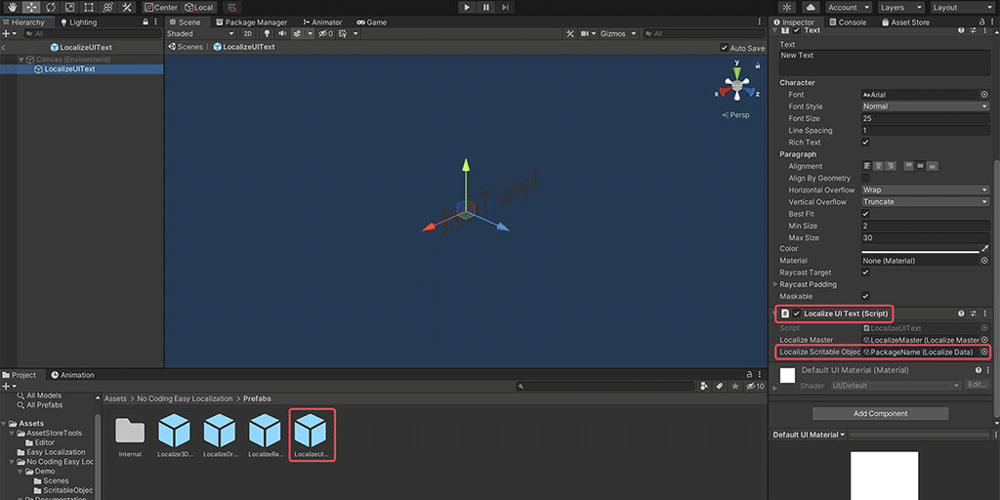

### LocalizeDropdown

This is a drop-down prefab for switching the display language.

It is recommended to use this when you have many languages to switch.

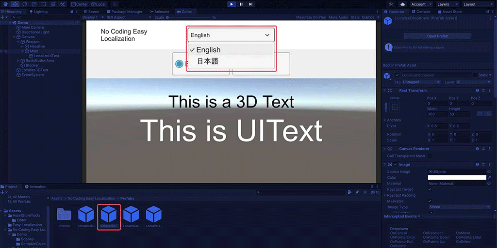

### LocalizeRadioGroup

This is a prefab of radio buttons for switching the display language.

It is recommended to use this when there are few languages to switch.

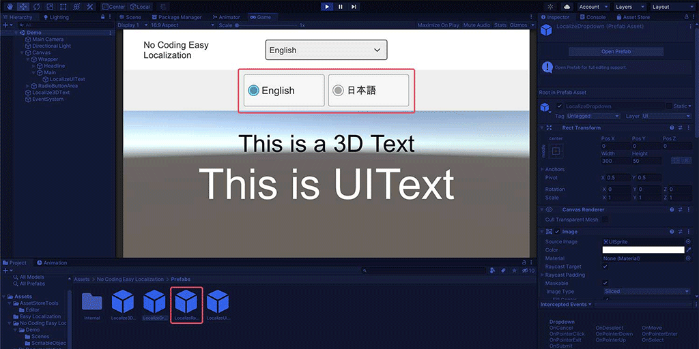

## To add other language support to an existing UI

If you want to tie other language features to an existing UI, please refer to the following methods.

### UI Text

Add Localize UI Text by clicking the Add Component button from the inspector of the existing UI Text.

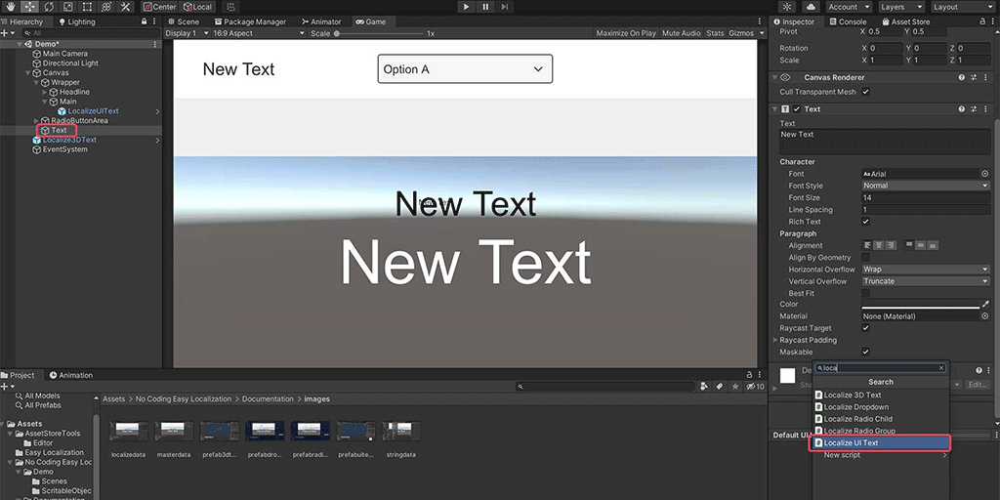

Click Localize Master to apply the master data.

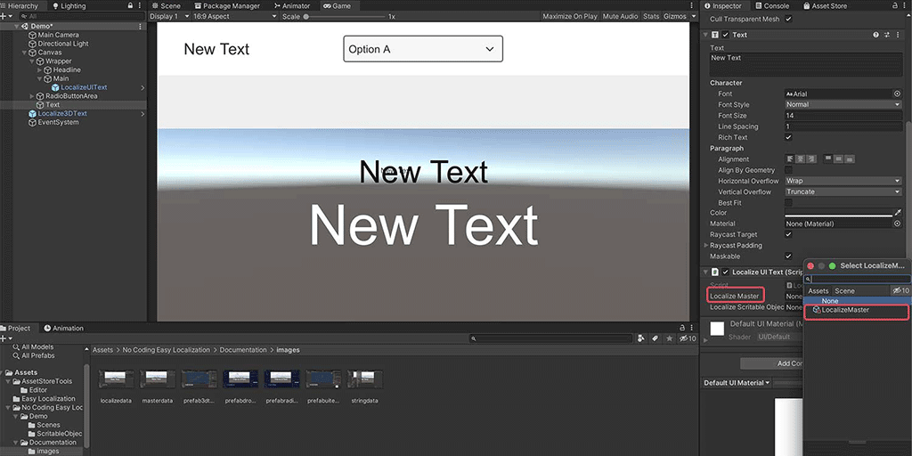

Click on Localize Scritable Object and select the Localize Data that you created yourself.

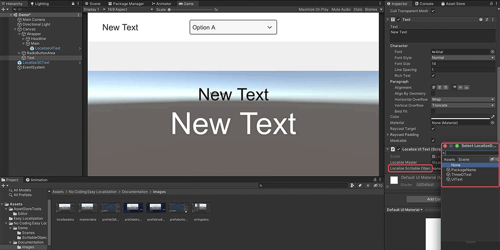

### 3D Text

Add Localize 3D Text by clicking the Add Component button from the inspector of the existing 3D Text.

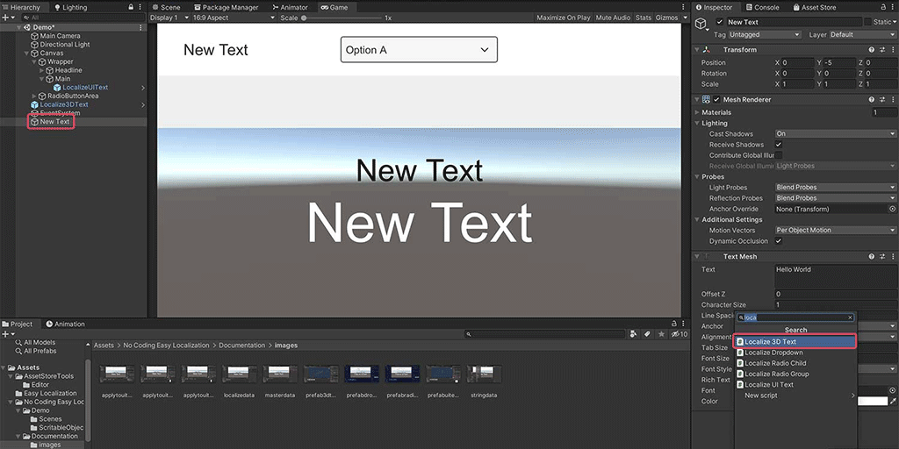

Click Localize Master to apply the master data.

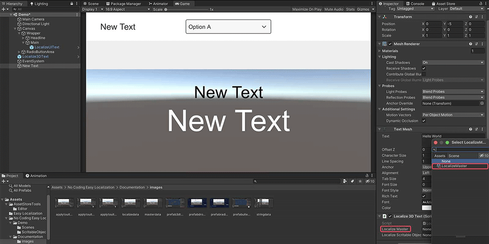

Click on Localize Scritable Object and select the Localize Data that you created yourself.

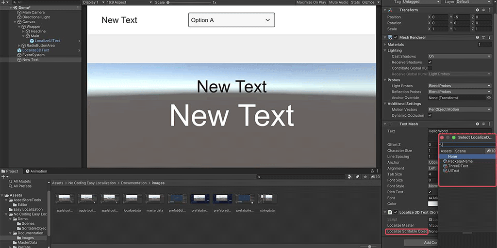

## Video explanation of how to use

http://www.youtube.com/watch?v=YjmmF6uv9hc

## Projects in which this asset is used

This asset is used in the following smartphone apps and mobile games. We hope you will install and check the behavior for your reference.

__AnimeCharPoses__

AppStore

[https://apps.apple.com/us/app/id1544202012](https://apps.apple.com/us/app/id1544202012)

GooglePlay

[https://play.google.com/store/apps/details?id=com.soarhap.animecharposes](https://play.google.com/store/apps/details?id=com.soarhap.animecharposes)

__Cat Ball Puzzle__

AppSore

[https://apps.apple.com/us/app/id1569167308](https://apps.apple.com/us/app/id1569167308)

GooglePlay

[https://play.google.com/store/apps/details?id=com.soarhap.catballpuzzle](https://play.google.com/store/apps/details?id=com.soarhap.catballpuzzle)

Thank you for purchasing this asset. I hope your project will be successful.
